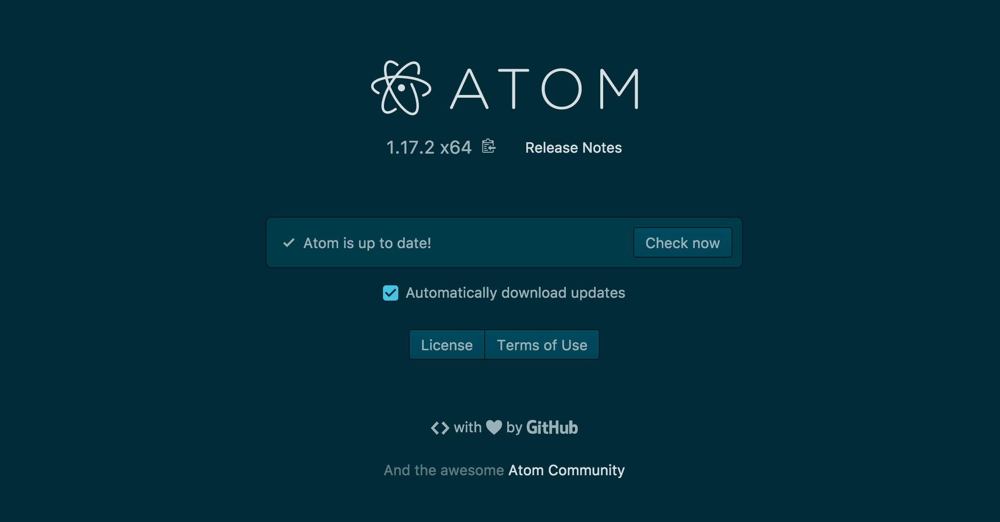

# Leeloo-url-shortener

  Shortening all the urls for Corbin Dallas.

## Pre-requisites

_Or highly effective tools that were used to during the creation of this app that I thought you should definitely have._

It is _HIGHLY_ recommended (no seriously just do it okay?) you have the following installed prior to beginning the Installation steps:

* [Oh My Zsh](https://github.com/robbyrussell/oh-my-zsh/wiki/Installing-ZSH) - because who doesn't like efficiency (bonus: it's pretty)
* [Homebrew](https://brew.sh/) - if your using MAC you already know
* [NVM Node Version Manager](https://github.com/creationix/nvm/blob/master/README.md) - self explanatory
* [Atom](https://flight-manual.atom.io/getting-started/sections/installing-atom/) - preferred text editor for this particular project
* [Nodemon](https://nodemon.io/) - efficiency remember? Nodemon monitors for any changes in the source and automatically restarts the server. Run the command in the cli or visit the link

      npm install -g nodemon

## Features

__St-st-st-style Guide Girl!__

Atom is the recommended IDE, as it supports the latest ESLint plugin, which you will need.  
  

__eslint packages__
Install the eslint packages by running the following in your favorite cli

    npm i --save-dev eslint
    npm i --save-dev eslint-config-airbnb
    npm i --save-dev eslint-plugin-import
    npm i --save-dev eslint-plugin-react
    npm i --save-dev eslint-plugin-jsx-a11y

Also install in the IDE the linter-eslint package which allows each file to lint. With Atom it is in the settings section.

## Le Branches

### Workflow

Create a new feature branch, merge feature branch to master branch, create a new tag and merge the master branch into the release branch

## Installation
__Steps__

__1. Clone the Repository__

   1. _Command Line_

Open your favorite cli, and type:

    $ git clone https://github.com/kmbeard/Leeloo-url-shortener.git

   2. _Browser_

Navigate to the Repository in your browser and select Clone or Download Repository

__2. Install Dependencies__

    npm install -d

__Utility Tool__

    npm install debug_tool

## Running running and running running
### To run the api:

__With the debug Tool__

Run the following in your favorite cli (inside of the project folder _obviously_)

    DEBUG=true nodemon src/server.js

__Without the debug Tool__

    nodemon src/server.js

## Endpoints

__POST /api/v1/urls__
Create a shortened url

__GET /api/v1/urls__
Display all urls

__GET /api/v1/urls/:id__
Display URL based upon id

__POST /api/v1/urls/:id__
Update URL based upon id

__DELETE  /api/v1/urls/:id__
Delete url based upon id

## Tests
Testing Framework used: mocha

__Install Mocha and Chai__

In the command line run the command:

    npm install --save-dev Mocha
    npm install --save-dev Chai

__Run Tests__

In the command line run the command:

    mocha
